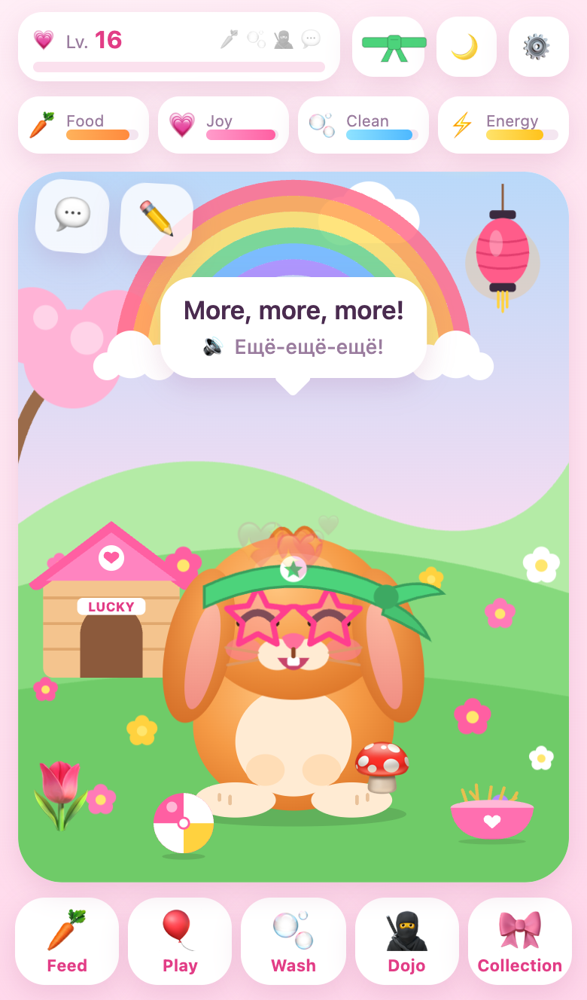
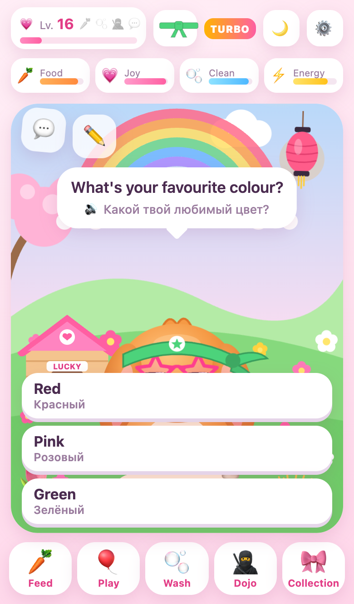
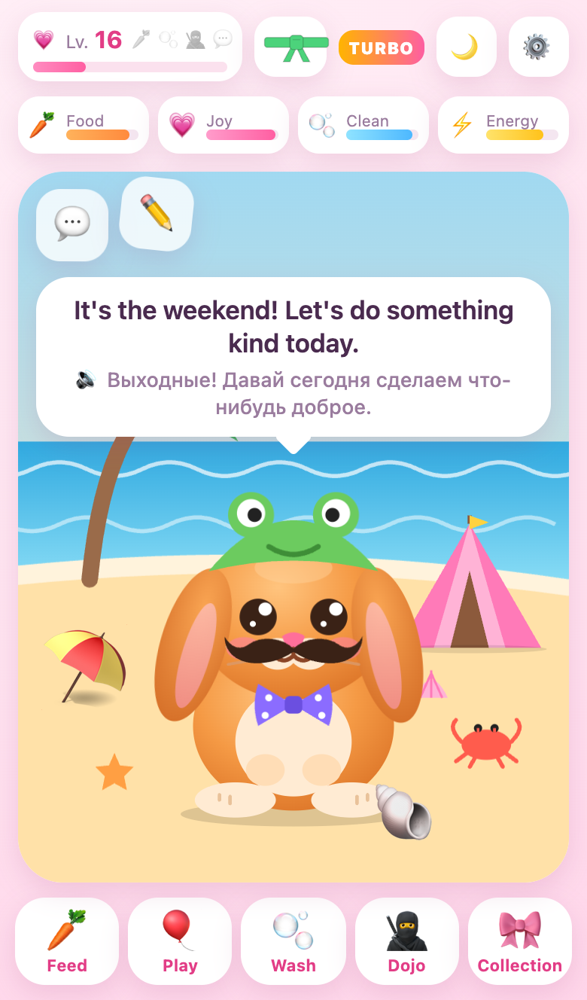
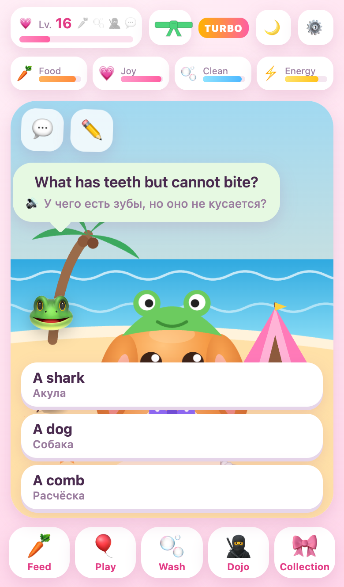
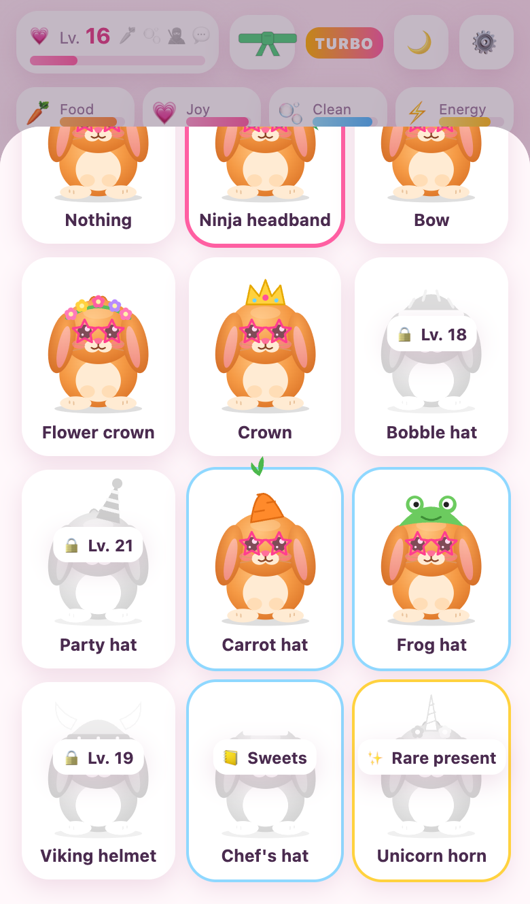
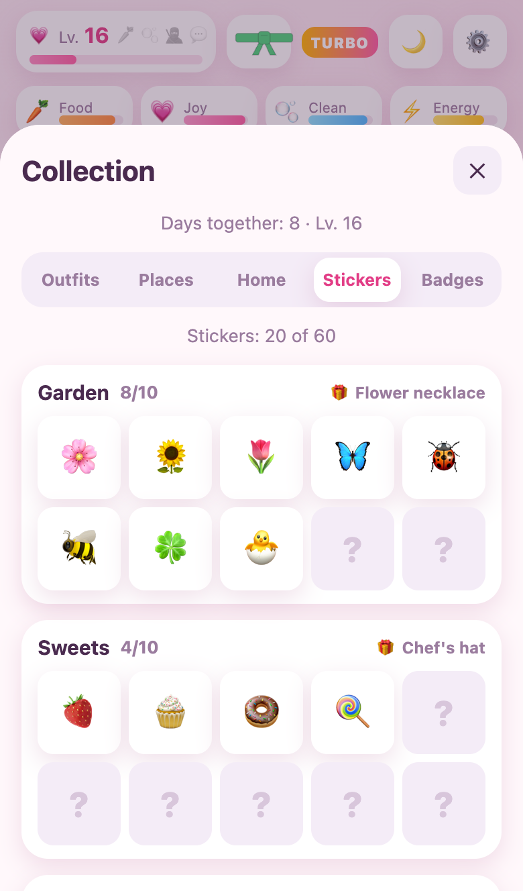
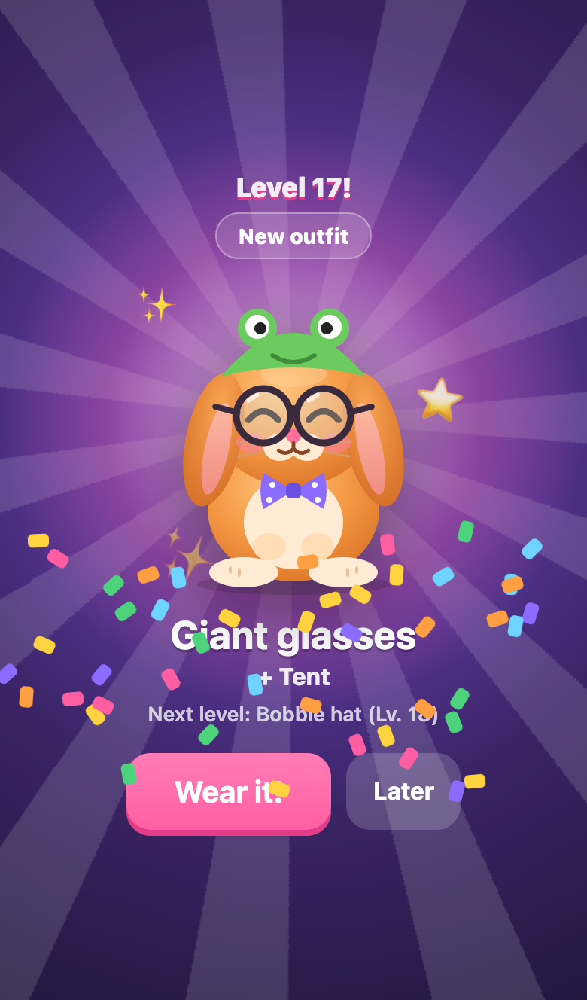
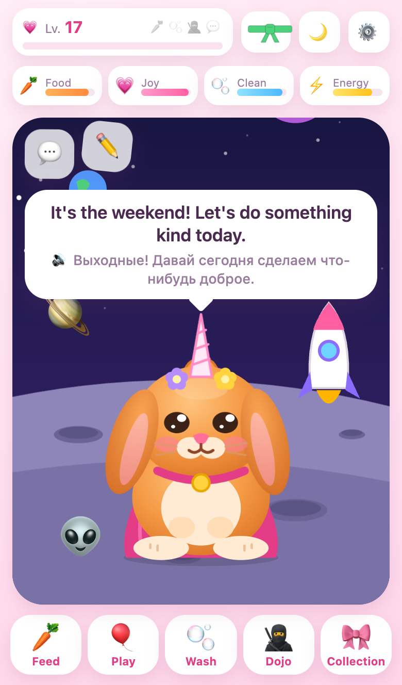

<p align="center">
  
</p>

<h1 align="center">🐰 Lucky — a gentle ninja-bunny pet</h1>

<p align="center">
  <b>A calm, funny, bilingual virtual pet for kids.</b><br>
  Plays in the browser, installs on a phone like an app, works offline.<br>
  No ads · no accounts · no in-app purchases · no data collection.
</p>

<p align="center">
  <a href="https://mig-kharkov.github.io/lucky-tamagotchi/"></a>
  
  
  <a href="LICENSE.md"></a>
  <a href="CHANGELOG.md"></a>
</p>

<p align="center">
  <a href="#-play-on-your-phone">📲 Play on your phone</a> ·
  <a href="#-whats-inside">✨ What's inside</a> ·
  <a href="#-make-it-yours">🎨 Make it yours</a> ·
  <a href="#-want-a-one-of-a-kind-version">💌 Custom versions</a> ·
  <a href="#-license-in-plain-words">📜 License</a>
</p>

<table align="center">
  <tr>
    <td></td>
    <td></td>
    <td></td>
    <td></td>
  </tr>
  <tr>
    <td></td>
    <td></td>
    <td></td>
    <td></td>
  </tr>
</table>

---

## 💗 Meet Lucky

Lucky is a ginger lop-eared bunny who dreams of earning the **Pink Master Belt** of ninja training.
His best friend **Tali**, a tiny white chihuahua with black spots, drops by to play, and a
**riddle frog** sometimes hops in with a puzzle.

Lucky talks with real recorded voices, reacts to how he feels, asks questions,
sneezes when you tap his nose and turns his ears into a helicopter.
Nothing bad ever happens to him: no illness, no dying, no guilt.

> [!NOTE]
> Lucky speaks **English**. A small **Russian translation** sits under every line —
> tap the speech bubble to hear it. Great for bilingual families.

## ✨ What's inside

| | |
|---|---|
| 🥕 **Care** | Feed (with real bunny facts), wash with bubbles, cuddle, tuck into bed |
| 😊 **Real moods** | Four moods from the pet's needs. Grumpy when hungry, over the moon when everything is perfect |
| 💬 **Conversations** | Lucky asks questions and you pick the answer: favourite things, *would you rather*, guessing games, mini-adventures |
| 🎮 **Mini-games** | Carrot Rain · Ninja Memory · Copy Lucky (melodies) · Chat with Lucky (English Q&A) |
| 🥷 **Ninja dojo** | One real-world mission a day (bunny hops, ninja breathing, find 3 pink things) plus caring for a real pet |
| 👗 **Wardrobe** | 28 funny items in 4 slots: Viking helmet, frog hat, moustache, tutu, dragon wings… mix and match |
| 🌍 **8 worlds** | Garden, sakura dojo, candy land, seaside, winter, outer space, Irish hills, ninja castle. Every world has things to tap |
| ✏️ **Decorate** | Drag your items and stickers anywhere in the scene, resize and flip them |
| 📒 **Collections** | 60 stickers in 6 albums (a full album gives a special item) and 34 badges |
| 😂 **Silly stuff** | Sneezes, hiccups, helicopter ears, tickle rolls, tail chasing, Tali's pranks, 19 kid-friendly jokes |
| 🌬️ **Feelings** | A daily *"How are you feeling?"* check-in and a guided ninja-breathing exercise |

## 🌱 Made for healthy play

Lucky is designed to be a **friend you visit, not a screen you can't put down.**

| Healthy by design | How |
|---|---|
| 👀 Watching is free | Just looking at Lucky costs nothing. Only active play counts |
| ⏸️ Natural breaks | After 15 minutes of play Lucky naps for an hour, **right there in his garden** |
| 🌙 Bedtime | From 22:00 to 07:00 Lucky sleeps, and so should you |
| ⏱️ Daily limit | Up to 60 minutes of active play a day (adjustable) |
| 📋 A clear finish line | *"Today's plan"*: four small jobs, then a celebration and *"go and play outside!"* |
| 🎁 Rewards by days, not minutes | Stickers, outfits and worlds arrive over weeks. Nothing rewards staying longer |
| 🚫 No dark patterns | No streaks to lose, no push notifications, no ads, no purchases |

All limits can be changed in the password-protected **parents' area** (⚙️).

## 📲 Play on your phone

> [!TIP]
> **Play now:** <https://mig-kharkov.github.io/lucky-tamagotchi/>

**iPhone / iPad**
1. Open the link in **Safari**.
2. Tap **Share** → **Add to Home Screen**.
3. Open Lucky from the new icon. After the first launch he works **offline**.

**Android**: open the link in Chrome → menu ⋮ → **Add to Home screen** (or **Install app**).

<details>
<summary><b>👨‍👩‍👧 Parents: allow only Lucky in Screen Time (iPhone)</b></summary>

- **Only this game in the browser:** Settings → Screen Time → Content & Privacy Restrictions →
  App Store, Media, Web & Games → Web Content → **Only Approved Websites** → add the game's address.
- **Time limit:** Screen Time → App Limits → Add Limit → **Websites** → add the game's address.
- Don't switch Safari off completely: Home Screen web apps run on Safari and would stop opening too.

</details>

<details>
<summary><b>🔒 The parents' area and its password (and what if you forget it)</b></summary>

**Setting it up**
1. The first time you tap ⚙️, you **create a parent password** on that phone.
   It is stored only on that device as a hash. It is never in the code or online.
2. Right after that, Lucky shows a **recovery code** once, like `K7QM-4XPA`.
   **Write it on paper or take a photo with *your* phone.** Don't screenshot it on the child's phone,
   because they could find it in Photos.

**Forgot the password?**
1. Tap ⚙️ → **Forgot the password?**
2. Enter the recovery code (capital letters and the dash don't matter).
3. Create a new password. You get a new recovery code, and **game progress is kept**.

**Lost the recovery code too?**
There is deliberately **no way to reset the password inside the game** without the code,
so a child can't take over the settings. The only way is to delete the game's data on the phone,
which **also erases the game progress**:
- Home Screen app: delete the Lucky icon, then add it again from Safari.
- In Safari: Settings → Apps → Safari → Advanced → Website Data → `mig-kharkov.github.io` → Delete.

> [!TIP]
> With Screen Time web restrictions on (see above), iOS usually greys out *Clear History and Website Data*,
> so the child can't wipe the game themselves. You can also block deleting apps in Screen Time.

**Inside the parents' area:** session length, rest time, bedtime, games per day, daily limit, sound, translation.
**Turbo** mode unlocks everything for testing and showing; your real progress comes back when you switch it off.

</details>

## 🎨 Make it yours

You are **welcome to change Lucky for yourself and your own family.** It's plain HTML, CSS and JavaScript:
no build step, no frameworks.

| I want to change… | Where |
|---|---|
| 👧 The child's and the dog's names | [`js/config.js`](js/config.js) |
| 💬 What Lucky says | [`js/i18n.js`](js/i18n.js) (lines, jokes, facts) and [`js/dialogs.js`](js/dialogs.js) (questions, stories, frog riddles) |
| 👗 Outfits | [`js/wardrobe.js`](js/wardrobe.js), each item is a small SVG drawing |
| 🌍 Worlds, decorations, stickers, badges | [`js/content.js`](js/content.js) and [`js/art.js`](js/art.js) |
| ⏱️ Default limits | [`js/state.js`](js/state.js) → `settings` |

**Voices.** The lines are pre-recorded with Google Cloud Text-to-Speech (Chirp 3 HD voices).
If you change a line or a name, the game automatically uses the phone's built-in voice for it.
To record your own clips, put `GOOGLE_TTS_KEY=...` into a local `.env.local` file (it's git-ignored)
and run `node tools/gen-voices.mjs`. Only new and changed lines are recorded.

**Run locally**
```bash
python3 -m http.server 8123
# open http://localhost:8123  (add ?debug for window.game in the console)
```

## 💌 Want a one-of-a-kind version?

Dreaming of a pet that is **truly someone's own**: their name, their real pet, their favourite
colours, worlds and jokes, in their language, with voices recorded just for them?

Our **Authorized Customizers** build fully custom versions to order. They handle the design,
voices, testing and support for you.

| | | |
|---|---|---|
| 👩‍💻 **Yulia** | Custom versions, testing and support | _contact coming soon_ |
| 👨‍💻 **Senya** | Custom versions, testing and support | _contact coming soon_ |

Or [open an issue](../../issues/new?template=custom-version.yml) and tell us about your idea. 💡
A custom version makes a lovely birthday present. 🎁

## 📜 License in plain words

Lucky is **source-available** under the [PolyForm Noncommercial License 1.0.0](LICENSE.md).

| You may ✅ | You may not ❌ |
|---|---|
| Play Lucky and install it on your family's devices | Sell Lucky or any version of it |
| Change anything for yourself and your own family | Offer customization of Lucky as a service to other people |
| Learn from the code, share the link | Use Lucky or its art, voices or texts in a commercial product |
| Use it at home, in a noncommercial club, a school or a charity | Remove the copyright notice |

> [!IMPORTANT]
> Custom versions **for other people** are made only by the copyright holder and the
> [Authorized Customizers](CUSTOMIZERS.md). See [`NOTICE`](NOTICE).

## 🔒 Privacy

Lucky collects **nothing**. There are no accounts, analytics, cookies, ads or servers: the game is
static files, and all progress stays in the phone's local storage.

## 🛠️ Under the hood

- Plain ES modules, SVG art, Web Audio sound effects, pre-recorded MP3 voices (~1250 clips, ~15 MB)
- A service worker for offline play (code network-first, voice clips cached once)
- Deployed to GitHub Pages by [GitHub Actions](.github/workflows/pages.yml). The cache version is set from the commit automatically
- Developer notes: [`docs/DEVELOPMENT.md`](docs/DEVELOPMENT.md) · game design: [`docs/DESIGN.md`](docs/DESIGN.md) · what's new: [`CHANGELOG.md`](CHANGELOG.md)

---

<p align="center">
  Made with 💗 by <a href="https://github.com/MiG-Kharkov">Igor Manzhos</a>
  for a little girl who loves pink, ninjas and her ginger lop-eared bunny.<br>
  <sub>Copyright © 2026 Igor Manzhos · <a href="LICENSE.md">PolyForm Noncommercial 1.0.0</a></sub>
</p>
